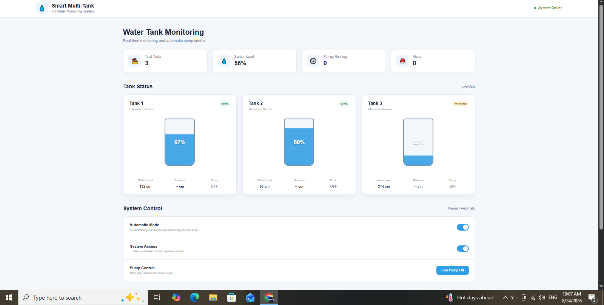

# Smart Multi-Tank IoT Monitoring & Control System

## 📌 Project Overview

The Smart Multi-Tank IoT system is a web-based monitoring and control interface designed for managing multiple water tanks.

## 🖥️ Dashboard Preview

## 🚀 Features

- Real-time multi-tank monitoring interface
- Three independent tank monitoring sections
- Tank level visualization
- Pump control
- System status monitoring
- Alarm indication
- Automatic and manual control concepts
- Responsive design for desktop and mobile devices
- Clean and user-friendly dashboard
- IoT-ready architecture

## 🛠️ Technologies Used

- HTML5
- CSS3
- JavaScript
- IoT concepts
- ESP32
- Ultrasonic sensors
- Relay modules
- GitHub Pages

## 🏗️ System Concept

The system is designed around three water tanks.

Ultrasonic sensors can be used to measure the water level in each tank. The controller processes the sensor data and provides the information to the monitoring dashboard.

The system can also control water pumps through relay modules and provide alarm notifications when required.

## 📊 Tank Monitoring

The dashboard is designed to monitor:

- Tank 1
- Tank 2
- Tank 3

Each tank can have its own water-level information and pump-control status.

## ⚙️ Control System

The system supports the concept of:

- Automatic pump operation
- Manual pump control
- Tank-level monitoring
- Alarm management
- System health monitoring

## 🌐 Live Demo

[Smart Multi-Tank IoT Live Website](https://ak03015944965-create.github.io/smart-multi-tank-iot/)

## 👨‍💻 Developer

**Engr. Abdul Rehman**

Electrical Engineering Student

## 🎯 Project Purpose

This project demonstrates the integration of:

- Embedded systems
- IoT
- Web development
- Sensor monitoring
- Automation
- Industrial control concepts

It can be further expanded into a complete IoT solution using ESP32, MQTT, Blynk, ThingsBoard, or a custom backend.

## 📄 License

This project is created for educational, portfolio, and demonstration purposes.
